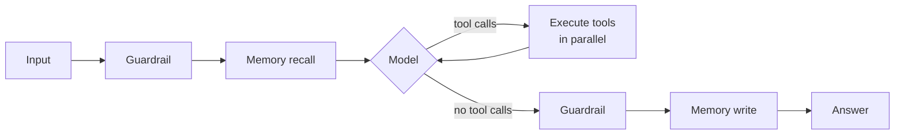

# Agents

An agent is a model that can act. The loop is simple — call the model, execute the tools it asks for, feed the results back, repeat until it answers — and Windlass implements it directly rather than requiring a graph library.



## Two runtimes

| | Built-in | LangGraph |
|---|---|---|
| Install | none | `windlass[agent]` |
| Execution | a loop | a compiled state machine |
| Streaming | token level | node level |
| Conditional routing, subgraphs | no | yes |
| Tools, memory, guardrails, checkpointing, HITL, tracing | yes | yes |

Start with the built-in runtime. Switch with `.graph()` when you need topology the loop cannot express.

## Building one

```python
from windlass import Windlass, tool

@tool
def search_tickets(query: str, status: str = "open") -> list[dict]:
    """Search the support ticket system.

    Args:
        query: Free-text search.
        status: One of open, closed, all.
    """
    return tickets.search(query, status=status)

agent = (
    Windlass.agent()
    .llm("claude-sonnet-4-5")
    .tool(search_tickets)
    .system("You are a support analyst. Cite ticket numbers.")
    .memory("window", window=20)
    .guardrails(pii=True, on_violation="redact")
    .max_iterations(15)
    .observe("langfuse")
)

response = agent.run("What are customers complaining about this week?")
```

## What comes back

```python
response.output       # the answer
response.messages     # the full transcript, including tool traffic
response.steps        # one AgentStep per iteration
response.tool_calls   # every call made, in order
response.usage        # aggregate tokens across the whole run
response.latency_ms
response.thread_id
```

```python
for step in response.steps:
    if step.thought:
        print(f"[{step.index}] {step.thought}")
    for call, result in zip(step.tool_calls, step.tool_results):
        flag = "ERROR" if result.is_error else "ok"
        print(f"     {call.name}({call.arguments}) -> {flag} {result.content[:60]}")
```

## Tools

The `@tool` decorator derives the schema from the type hints and the docstring:

```python
@tool
def create_ticket(
    title: str,
    priority: Literal["low", "medium", "high"] = "medium",
    labels: list[str] | None = None,
) -> dict:
    """Create a support ticket.

    Args:
        title: Short summary of the issue.
        priority: Urgency.
        labels: Optional labels to attach.
    """
    return api.create(title=title, priority=priority, labels=labels or [])
```

The description is prompt text — the model chooses tools based on it. Vague descriptions cause bad calls, so treat them like prompts, because they are.

### Parallel execution

Models routinely request three or four independent lookups in one turn. Windlass runs them concurrently, which is where a lot of agent latency quietly hides.

```python
agent.parallel_tools(False)   # force serial when tools share mutable state
```

### Failures reach the model, not your stack

A tool that raises produces an error `ToolResult`, which is handed back so the model can recover:

```
tool: RuntimeError: ticket service returned 503
assistant: The ticket service is unavailable right now. Shall I retry, or would
           you like the cached summary from this morning?
```

Timeouts work the same way — a hung tool fails the call, not the run.

### Approval gating

```python
@tool(requires_approval=True)
def refund(order_id: str, amount_cents: int) -> dict:
    """Issue a refund to a customer."""
    return payments.refund(order_id, amount_cents)
```

See [human in the loop](#human-in-the-loop).

## Memory

```python
agent.memory()                      # sliding window, the default
agent.memory("buffer")              # everything
agent.memory("summary")             # summarises overflow with an LLM
agent.memory("vector")              # durable facts, recalled by relevance
agent.memory("composite", memories=[window, long_term])
```

`thread_id` scopes every conversation, so one agent instance serves many concurrent users:

```python
agent.run("Hello", thread_id="user-42")
agent.run("Carry on", thread_id="user-42")
agent.run("Different person", thread_id="user-99")
```

!!! note "Window memory keeps tool pairs together"
    A window that cut between an assistant's tool call and the matching result would produce a transcript some providers reject. `WindowMemory` detects that and widens the window.

## MCP

```python
agent = (
    Windlass.agent()
    .llm("gpt-4o")
    .tool(local_function)
    .mcp(command="npx", args=["-y", "@modelcontextprotocol/server-filesystem", "."])
    .mcp(url="https://mcp.internal/sse", server="internal")
)
```

Remote tools are bound alongside local ones and the model cannot tell them apart. With more than one server, names are namespaced (`filesystem_read`, `internal_search`) so identically-named tools do not collide.

An unreachable server logs a warning and contributes no tools — an agent that works with four of its five tool sources is more useful than one that refuses to start.

## Streaming

```python
for event in agent.stream("Research this and summarise"):
    if event.type == "text":
        print(event.delta, end="", flush=True)
    elif event.type == "tool_call":
        print(f"\n[{event.tool_call.name}]")
    elif event.type == "done":
        print()
```

```python
async for token in agent.astream_text("..."):
    await websocket.send(token)
```

## Human in the loop

Anything that spends money or mutates state deserves a human in the path. Windlass pauses the run, checkpoints it, and lets you resume.

```python
from windlass import AgentInterrupt

agent = (
    Windlass.agent()
    .llm("gpt-4o")
    .tool(refund)                       # declared requires_approval=True
    .checkpoint("sqlite", path="./state.db")
)

try:
    response = agent.run("Refund order 1234", thread_id="session-7")
except AgentInterrupt as pause:
    print(pause.payload)                # what it wants to do
```

Then, whenever the human decides:

```python
agent.resume("session-7", approved=True)

agent.resume("session-7", approved=False,
             feedback="Outside the refund window — offer credit instead.")

agent.resume("session-7", approved=True,
             edited_arguments={"call_abc": {"amount_cents": 2500}})
```

Rejection feedback goes back to the model as the tool result, so it tries a different approach rather than repeating itself.

To gate *every* tool call:

```python
agent.human_in_the_loop()
```

## Checkpointing

```python
agent.checkpoint()                                # in-process
agent.checkpoint("sqlite", path="./state.db")     # durable, survives restarts
```

Buys three things: resumability (an interrupted run continues instead of re-paying for every token already spent), multi-turn continuity, and time travel:

```python
agent.state("session-7")            # latest snapshot
agent.history("session-7")          # recent snapshots, newest first
```

## Multi-agent

One agent with thirty tools reasons badly: the tool list crowds the context, and the model has to hold every domain at once. Specialise, then coordinate.

### Supervisor

```python
researcher = Windlass.agent().llm("gpt-4o").tool(web_search, read_page)
writer     = Windlass.agent().llm("claude-sonnet-4-5").system("Write clearly and concisely.")
reviewer   = Windlass.agent().llm("gpt-4o").system("Check facts against the sources.")

boss = Windlass.supervisor(
    {"researcher": researcher, "writer": writer, "reviewer": reviewer},
    llm=Windlass.llm("gpt-4o"),
    descriptions={
        "researcher": "Finds and summarises source material from the web.",
        "writer":     "Turns notes into clear prose.",
        "reviewer":   "Verifies claims against sources and flags anything unsupported.",
    },
)

print(boss.run("Write a briefing on the EU AI Act's timeline"))
```

The supervisor sees each specialist as a tool, so delegation is ordinary tool calling — no special routing mechanism. Write the descriptions carefully: they are what the routing decision is made on.

### Broadcast and pipeline

```python
results = boss.broadcast("Assess this proposal")     # everyone, concurrently
final   = boss.pipeline("Write a briefing on X",
                        ["researcher", "writer", "reviewer"])   # in sequence
```

Broadcast for independent work or ensembling; pipeline when each stage genuinely depends on the last.

## Custom graphs

```python
from langgraph.graph import END

agent = Windlass.agent().llm("gpt-4o").tool(search).graph()

graph = agent.native_graph()
graph.add_node("critic", critique)
graph.add_edge("tools", "critic")
graph.add_conditional_edges(
    "critic",
    lambda state: "retry" if state["needs_work"] else "done",
    {"retry": "agent", "done": END},
)
agent.recompile()
```

```python
print(agent.draw())     # a Mermaid diagram of the compiled graph
```

## The step budget

```python
agent.max_iterations(15)
```

A confused agent will happily loop until your budget runs out. When the ceiling is hit you get `MaxIterationsExceeded` rather than a bill.

If you hit it regularly, the cause is usually one of: a tool description the model misreads, a tool returning something it cannot use, or a task that genuinely needs decomposition into specialists.

## Design guidance

**Few tools, well described.** Five well-named tools beat twenty overlapping ones. Descriptions are prompts.

**Return what the model can use.** A tool returning a 40-field object teaches the model to guess. Return the three fields that matter.

**Gate consequential actions.** `requires_approval=True` on anything that spends money, sends a message or deletes data.

**Least privilege.** Bind the smallest capability that does the job. A search tool scoped to one index is safer than a database tool that accepts SQL — prompt injection is real, and the strongest mitigation is that the injected instruction has nothing dangerous to reach.

**Treat retrieved text as untrusted.** It can contain instructions. Run guardrails on it, not just on user input.

**Set a budget.** `max_iterations` and per-tool `timeout` are the difference between a bad afternoon and a bad quarter.
