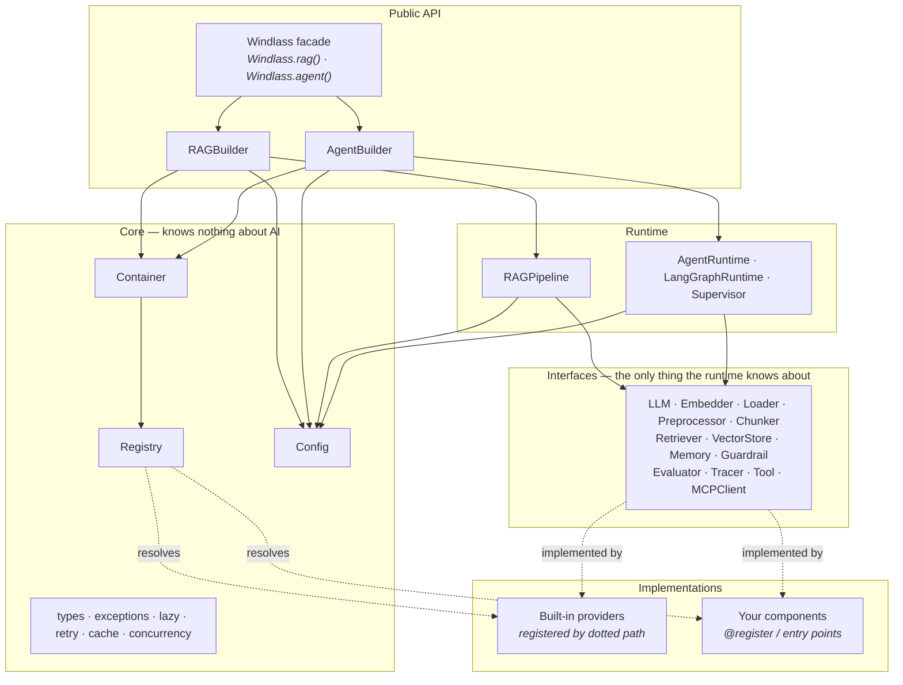

# Architecture

Windlass has one architectural rule, and everything else follows from it:

!!! quote "The rule"
    **No module in Windlass imports a concrete provider.** Components are resolved by name through a registry, and wired through a container.

That is the dependency inversion principle applied without compromise. It is why swapping FAISS for Pinecone is a string change, why `import windlass` costs nothing, and why a component you write in your own repo is indistinguishable from a built-in one.

## The layers



Dependencies point **inwards**. The runtime depends on interfaces; implementations depend on interfaces; nothing depends on an implementation.

## The registry

Every replaceable part of Windlass is a **component kind**. There are fifteen:

`llm` · `embedding` · `loader` · `preprocessor` · `chunker` · `retriever` · `vectordb` · `memory` · `guardrail` · `evaluator` · `tracer` · `tool` · `mcp` · `cache` · `checkpointer`

The registry maps `(kind, name)` to an implementation. Crucially, it can hold a **dotted path** instead of a class:

```python
REGISTRY.register_lazy(
    "vectordb", "pinecone",
    "windlass.providers.vectordb.pinecone:PineconeVectorStore",
    extra="pinecone",
)
```

No import happens. The module is imported the first time somebody actually asks for that component — which is why `import windlass` registers sixty-odd components in a few milliseconds and pulls in zero optional dependencies.

There are three ways to register:

=== "Decorator"

    ```python
    from windlass import register, Chunker

    @register.chunker("by-sentence")
    class SentenceChunker(Chunker):
        """Splits on sentence boundaries."""

        def split_text(self, text: str) -> list[str]:
            return [s for s in text.split(". ") if s]
    ```

=== "Lazy path"

    ```python
    from windlass import REGISTRY

    REGISTRY.register_lazy(
        "chunker", "by-sentence", "my_pkg.chunkers:SentenceChunker"
    )
    ```

=== "Entry point"

    ```toml
    # in your package's pyproject.toml
    [project.entry-points."windlass.chunker"]
    by-sentence = "my_pkg.chunkers:SentenceChunker"
    ```

    Installing your package makes the component appear in Windlass. No code change on either side.

Discovery runs once, lazily, on the first registry lookup. See [Writing plugins](../guides/plugins.md).

## The container

The registry answers *"what implements this name?"*. The container answers *"what should this pipeline use?"*.

```python
container = Container()
container.bind("llm", lambda: MyModel())
container.bind_instance("tracer", my_tracer)

llm = container.resolve("llm")
```

Containers **nest**. `scope()` returns a child that inherits every binding and can override any of them without disturbing the parent — which is how a sub-agent gets its own model while sharing the parent's tracer.

The method that does the real work is `component()`, and it is why every builder argument accepts three shapes:

```python
container.component("chunker", "semantic", chunk_size=800)   # a registry name
container.component("chunker", MyChunker(chunk_size=800))    # an instance
container.component("chunker", lambda: MyChunker())          # a factory
```

One funnel, three shapes, no special cases anywhere else in the codebase.

The process-wide root container is the seam for application-level wiring:

```python
Windlass.container().bind_instance("tracer", my_tracer)
```

Every builder created afterwards inherits it.

## The builders

A builder records *intent*. Nothing is constructed until the first real call:

```python
rag = Windlass.rag().chunker("semantic").vectordb("pinecone")
# ← nothing imported, nothing connected, no credentials checked

rag.ingest("./docs")
# ← now everything is built, in dependency order
```

That laziness buys three things: reconfiguration stays free, a builder naming Pinecone does not import Pinecone until you use it, and configuration errors surface at a predictable moment (or at startup, if you call `.build()` explicitly).

### Where the integration work actually goes

`build()` is where Windlass earns its keep. Components are not independent — they have a dependency graph that somebody has to resolve:

- the **semantic chunker** needs the pipeline's embedder;
- the **vector retriever** needs the embedder *and* the store;
- **hybrid retrieval** needs a dense leg and a lexical leg over the same corpus;
- **FAISS and Pinecone** need the embedding dimensionality before the first write;
- **parent-child chunking** requires the retriever to expand children into parents;
- **contextual retrieval** needs a base retriever and a model, and must enrich chunks *before* they are embedded.

Wiring that by hand, correctly, every time, is precisely the integration work Windlass exists to remove.

## The interfaces

Thirteen contracts, one per component kind. Every one:

- is **async-first** — implementers write `a*` coroutines and the blocking API is derived, so the two cannot drift;
- extends `Component`, which supplies naming, configuration, lifecycle and `describe()`;
- exposes `native()`, the Level 3 escape hatch that returns the underlying SDK object.

The typical implementation is small, because the base class does the repetitive work:

```python
class MyChunker(Chunker):
    """Splits on double newlines."""

    def split_text(self, text: str) -> list[str]:      # ← the only required method
        return text.split("\n\n")
```

Document iteration, metadata propagation, offset tracking, id assignment, under-sized chunk merging, concurrency: all handled.

## Async and the sync bridge

Interfaces define coroutines. The blocking variants call `run_sync`, which picks a strategy:

- **No loop running** — `asyncio.run`, fully isolated.
- **A loop already running** (Jupyter, FastAPI, LangServe) — dispatch to a dedicated background loop thread and block on the result.

The second case is why `rag.ask(...)` works inside an async web handler where a naive bridge would raise `RuntimeError: asyncio.run() cannot be called from a running event loop`.

!!! note "Streaming needs one loop"
    `iter_sync` drives an async generator across many `__anext__` calls. Those must share a loop: `asyncio.run` calls `loop.shutdown_asyncgens()` on exit, which finalises a suspended generator. A bridge that used `asyncio.run` per item would yield exactly one element and stop. Windlass pins the whole iteration to the background loop.

## Errors

One hierarchy, rooted at `WindlassError`, so an application can wrap any Windlass call in one `except`. Each error carries a `hint` that says what to do:

```
MissingDependencyError: The Pinecone vector store is not installed.

Hint: Run:

    pip install "windlass[pinecone]"
```

```
ComponentNotFoundError: No chunker named 'sematic' is registered.

Hint: Available chunkers: code, markdown, parent_child, recursive, semantic, token
Register your own with @windlass.register.chunker('sematic').
```

Optional-dependency `ImportError`s are translated at the single choke point (`core.lazy`), so a raw one never reaches user code.

### Degrade, don't crash

Some failures should not stop the world, and Windlass draws that line deliberately:

| Failure | Behaviour |
|---|---|
| A tool raises | Reported to the model as a tool result, so it can recover |
| One hybrid retrieval leg fails | Logged, the other legs still answer |
| An MCP server is unreachable | Logged, its tools are simply not bound |
| A tracer throws | Swallowed — observability never breaks the thing it observes |
| A checkpoint write fails | Logged, the run continues |
| One file in a corpus is corrupt | Skipped under `on_error="skip"` |
| Credentials are wrong | **Raises immediately** — retrying would waste a minute to fail identically |

## Reading the source

| Path | What lives there |
|---|---|
| `core/` | Registry, container, config, types, exceptions, retry, cache, concurrency. Knows nothing about AI. |
| `interfaces/` | The thirteen contracts. Depends only on `core`. |
| `providers/` | Every concrete implementation, plus the lazy manifest in `providers/__init__.py`. |
| `rag/` | `RAGBuilder`, `RAGPipeline`, loader auto-detection. |
| `agent/` | `AgentBuilder`, the built-in runtime, the LangGraph runtime, the supervisor, checkpointing. |
| `tools/` | The `@tool` decorator, schema generation, the tool registry. |
| `api.py` | The `Windlass` facade. |
| `testing.py` | Doubles and helpers for testing applications built on Windlass. |

`providers/__init__.py` is the best single file to read: it is the complete catalogue of what ships, one line per component, with the extra each one needs.
