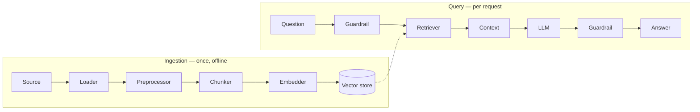

# Retrieval-augmented generation

RAG is two pipelines that share a data model.



Windlass wires both and lets you replace any box.

## Ingestion

```python
rag = Windlass.rag()
rag.ingest("./documents")
```

Each stage is separately configurable:

```python
rag = (
    Windlass.rag()
    .loader("pdf", per_page=True)
    .preprocessor("clean", min_length=100)
    .preprocessor("dedup", threshold=0.9)
    .preprocessor("pii", action="redact")
    .chunker("semantic", chunk_size=1000)
    .embedding("huggingface")
    .vectordb("faiss", persist_path="./index")
)
```

### Idempotence

Chunk ids are content hashes, so re-ingesting unchanged content **upserts** rather than duplicating:

```python
rag.ingest("./docs")   # 1,240 chunks
rag.ingest("./docs")   # still 1,240
```

Combined with a configured embedding cache, re-ingesting a mostly-unchanged corpus costs almost nothing.

### Metadata

Metadata travels from the document to every chunk derived from it, and is what makes filtered retrieval possible:

```python
rag.ingest("./docs/legal", metadata={"department": "legal", "tenant": "acme"})

rag.ask("What is our indemnity cap?", filters={"department": "legal"})
rag.ask("...", filters={"year": {"$gte": 2024}, "tenant": "acme"})
```

Supported operators: `$eq` `$ne` `$gt` `$gte` `$lt` `$lte` `$in` `$nin` `$contains` `$exists`. Stores with native filtering push them down; the rest apply them in-process, and the semantics are identical either way.

## Chunking

The highest-leverage decision in a RAG system. It determines what the retriever can find and what the model gets to read.

| Strategy | Use it for | Why |
|---|---|---|
| `recursive` | Prose — the default | Splits on the largest natural boundary that fits, so chunks end where a human would end them |
| `token` | Hard context budgets | `chunk_size=512` with `top_k=8` guarantees ~4k tokens regardless of how verbose the source is |
| `semantic` | Long-form documents | Boundaries land at topic shifts, not at character counts |
| `markdown` | Docs, wikis, READMEs | Prefixes each chunk with its heading path — nearly free context |
| `code` | Source repositories | A chunk is a complete function, not its middle eight lines |
| `parent_child` | Precision *and* context | Index small, retrieve small, generate from the parent |

### Why the heading path matters

A chunk reading "the timeout defaults to 30 seconds" is unfindable. With `markdown` chunking it becomes:

```
Configuration > Networking > Timeouts

the timeout defaults to 30 seconds
```

Now it matches a query about network configuration.

### Parent-child, in one paragraph

Small chunks retrieve better (a focused embedding matches a focused query); large chunks answer better (the model needs surrounding context). Parent-child refuses the trade-off: it indexes children, and swaps each matched child for its parent before building the prompt.

```python
rag = Windlass.rag().chunker("parent_child", parent_size=2000, child_size=400)
```

The pipeline wires the expansion automatically.

## Retrieval

### Dense

```python
rag.retriever("vector", diversity=0.3)
```

`diversity` enables MMR. Without it, top-k on a corpus with near-duplicate passages returns five versions of the same paragraph.

### BM25

```python
rag.retriever("bm25")
```

Okapi BM25 over an in-process inverted index. No dependency, and it finds the exact identifiers — `E1042`, a SKU, a function name — that embeddings reliably miss.

### Hybrid — the one to use

```python
rag.retriever("hybrid")                          # dense + BM25, equal weight
rag.retriever("hybrid", weights=[0.7, 0.3])      # favour dense
```

Vector search and BM25 fail in opposite ways. Running both and fusing beats either alone on virtually every benchmark.

Windlass fuses with **Reciprocal Rank Fusion**, which combines *ranks* rather than scores. That matters: a cosine similarity of 0.81 and a BM25 score of 14.3 are not comparable quantities, and normalising them needs corpus statistics that change on every ingest. Ranks need no normalisation at all.

The two legs run concurrently, so hybrid costs about as much wall-clock time as its slower leg.

### Contextual

```python
rag.retriever("contextual", enrich=True, transform="hyde")
```

Two techniques attacking retrieval failure from opposite ends:

- **Enrichment** (index time): a small model writes one situating sentence per chunk. "Revenue grew 3%" becomes "From the Q3 2024 earnings report, segment results: revenue grew 3%." Anthropic's published results put the reduction in retrieval failures at roughly 35–50%.
- **HyDE** (query time): the model writes a hypothetical *answer* and that gets embedded, because answers live closer to answers in embedding space than questions do.

Enrichment is paid once; HyDE is paid per query. Measure before enabling HyDE on a latency-sensitive path.

## Generation

```python
answer = rag.ask("What is our refund policy?")

answer.answer          # the text
answer.contexts        # the chunks that went into the prompt, in prompt order
answer.sources         # deduplicated source list
answer.usage           # token accounting
answer.latency_ms      # end to end
answer.metadata        # model, retrieved count, retrieval latency
```

### Context assembly

Chunks are numbered and cited, then added highest-ranked first until `max_context_tokens` is reached. **The tail is dropped, not the head** — the best context is never what gets cut.

```python
rag.max_context_tokens(12_000)
```

### The prompt

The default asks the model to use only the provided context and to say so when the answer is not there. Replace it when you need to:

```python
rag.prompt("""
You are a legal assistant. Answer strictly from the context.
Quote the exact clause you rely on, then explain it in plain language.
If the context does not settle the question, say so and stop.

<context>
{context}
</context>

Question: {question}

Answer:
""")
```

`{context}` and `{question}` are required; the builder rejects a template missing either.

### Strict mode

```python
rag.strict()
```

With no retrieval results, the pipeline returns a refusal instead of calling the model with an empty context. This is the single most effective anti-hallucination setting available: it removes the *opportunity* to invent rather than asking the model not to.

## Multi-turn

```python
rag = Windlass.rag().memory("window", window=10)

rag.ask("What is our refund policy?", thread_id="user-42")
rag.ask("Does that apply to annual plans?", thread_id="user-42")
```

## Persistence

```python
rag = Windlass.rag().vectordb("faiss", persist_path="./index")
rag.ingest("./docs")
rag.save("./index")
```

```python
rag = Windlass.rag().vectordb("faiss", persist_path="./index")
rag.load("./index")     # also rebuilds any lexical index
```

Chroma and Pinecone persist automatically.

## Evaluating

```python
report = rag.evaluate(
    [{"question": "...", "reference": "..."}, ...],
    metrics=["faithfulness", "answer_relevancy", "context_precision_lexical"],
)
```

Evaluate retrieval separately from generation — most RAG failures are retrieval failures wearing a generation costume:

```python
hits = rag.search("What is the refund window?")
assert any("30 days" in h.chunk.content for h in hits)
```

## Tuning, in order

When quality is not good enough, work in this order — earlier steps have far more leverage:

1. **Look at what was retrieved.** If the right chunk is not in `answer.contexts`, no prompt engineering will help.
2. **Fix chunking.** Wrong size or wrong boundaries is the most common root cause. Try `markdown` for docs, `parent_child` for mixed content.
3. **Switch to hybrid retrieval.** Especially if your corpus contains identifiers, codes or product names.
4. **Raise `top_k` and the context budget.** Cheap to try, immediately measurable.
5. **Upgrade the embedding model.** `bge-small` → `bge-m3` is a real jump, and requires re-ingesting.
6. **Add contextual enrichment.** Real gains, paid once at ingestion.
7. **Only then, tune the prompt.**

See [Best practices](../guides/best-practices.md).
